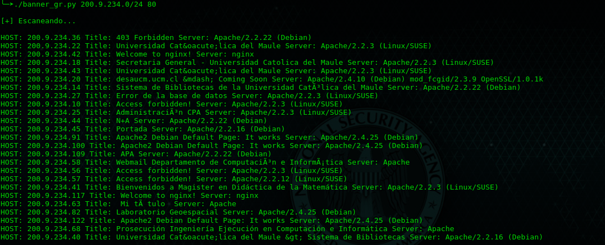

# grabbing_banner
Este Script puede ser usando para realizar Banner Grabbing a rangos de IPs publicas.

## Uso
Solo tienes que ingresa un rango de IPs y el un numero de puerto para encontrar informacion
de servidores HTTP, informacion como **Title de la pagina** y **nombre del servidor**

### Instalando dependencias
```
pip install requests
pip install ipaddress
```

### Corriendo Script
```
./banner_gr <rango ip> <puerto>
```

## Preview

